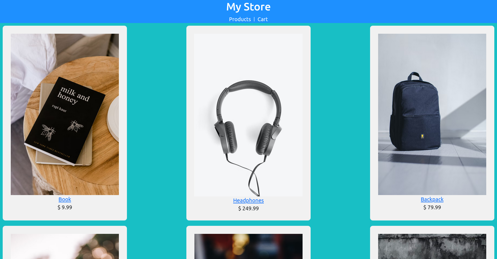
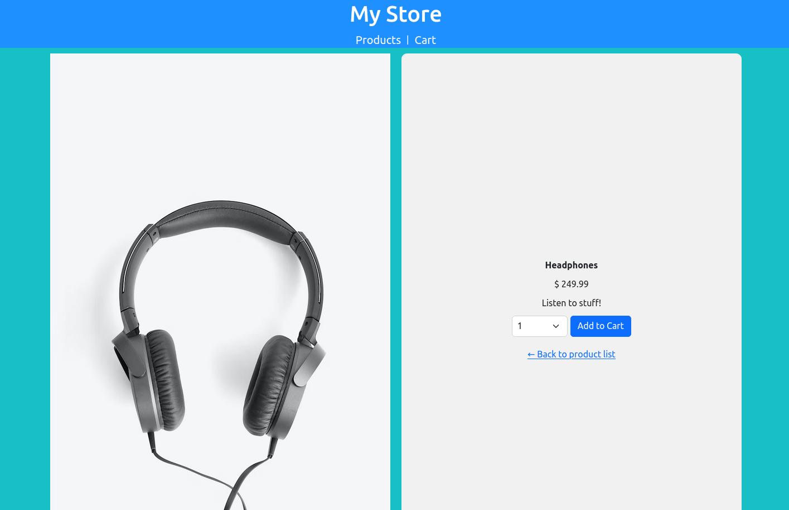
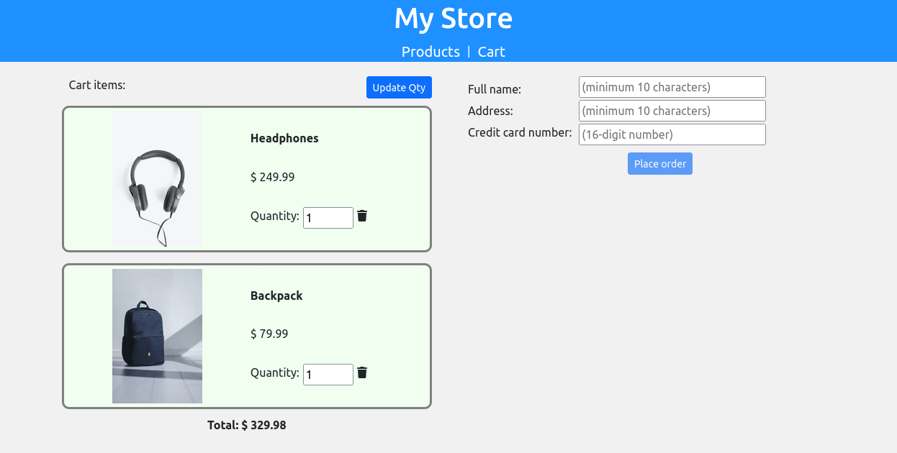
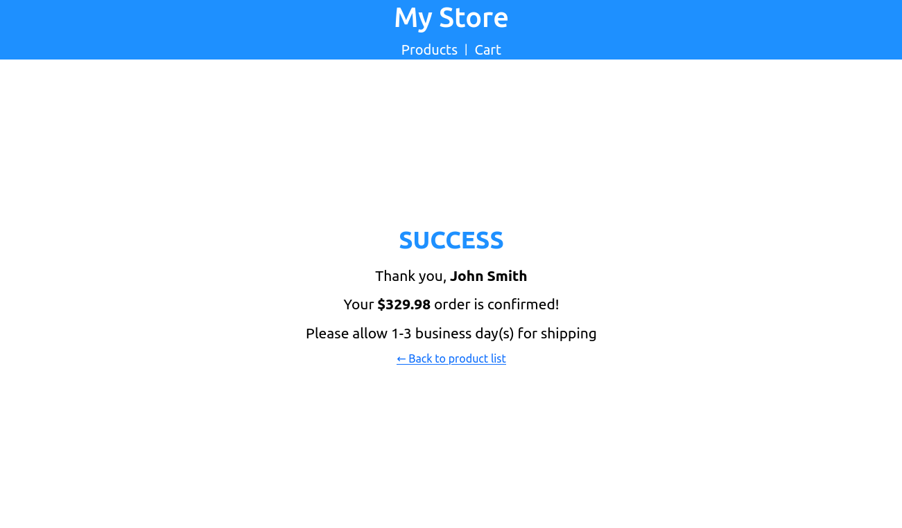

### FSJND - My Store

---

#### Overview

This is a single-page application built with Angular, which offers a rich, dynamic experience on the web.

The user experience and flow of the application resemble that of a typical e-commerce application, including:

1. The shopping cart page shows a total cost for all products in the cart
1. Input forms are validated
1. Feedback is given to the user when the cart is modified
1. The details page for a product shows a photo of the product, the name, the price, and the description.
1. Products can be removed from the cart
1. An order confirmation page is shown to the user after successful checkout

---

#### Screenshots

1. Product list

    

1. Product details

    

1. Cart

    

1. Checked out

    

---

#### Instructions

1. How to build

    ```shell
    $ git clone https://github.com/raymondngiam/FSJND-MyStore.git
    $ cd FSJND-MyStore
    $ npm install
    $ ng build
    ```

1. How to run

    ```shell
    $ ng serve
    ** Angular Live Development Server is listening on localhost:4200, open your browser on http://localhost:4200/ **
    ```